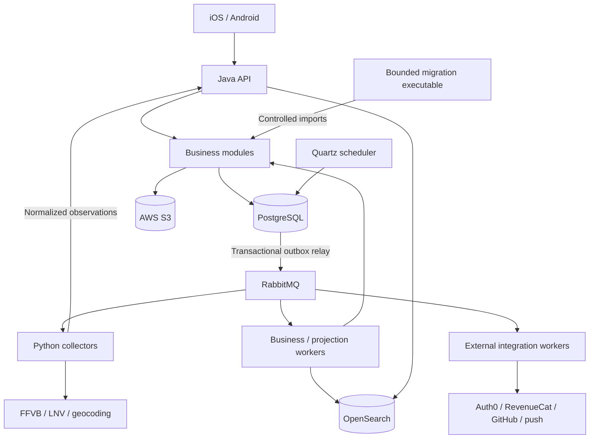

# Blockout V2 architecture

## Authority and scope

This is the target architecture for the complete backend, acquisition and mobile
rebuild. Accepted F01–F14 specifications own observable behavior; the
[constitution](../../.specify/memory/constitution.md) governs this document.
The [domain model](blockout-domain-model-v2.md),
[transition design](v1-v2-transition-architecture.md) and
[planning boundaries](v2-planning-boundaries.md) complete this baseline.
The architecture decision and delivery owner is
[#305](https://github.com/blockoutproject/blockout/issues/305), under
[#248](https://github.com/blockoutproject/blockout/issues/248).

| Evidence category            | Meaning in this architecture                                                                                                                                                          |
| ---------------------------- | ------------------------------------------------------------------------------------------------------------------------------------------------------------------------------------- |
| Accepted requirement         | F01–F14 semantics, continuity, privacy, quality and accepted design.                                                                                                                  |
| Imposed technical constraint | Nx monorepo; Auth0 and RevenueCat continuity; Hostinger and Dokploy; AWS for files/backups; private GitHub assistance. FFVB discovery/CSV and source-first contracts remain binding.  |
| Owner-selected decision      | Liquibase instead of the initial Flyway proposal; preservation and transformation of the V1 club registry and logos; current mobile baseline without a legacy-OS compatibility layer. |
| V1 observation               | Existing services, schemas, endpoints, Elasticsearch, SDKs and source adapters are discovery/transition evidence, not target defaults.                                                |
| Assumption                   | No independent delivery team per domain is established. Recent production capacity measurements are unavailable. Automatic server-loss failover is not a launch requirement.          |
| Architecture recommendation  | The topology, ownership, tools and protocols below. They need qualification, not a claim that installation alone proves correctness.                                                  |

The existing 4-CPU/16-GB/256-GB VPS does not constrain target capacity. Keep V1
operational during preparation. Do not derive concurrency from 10,000 registered
users or weekend launches.

## Product properties and quality envelope

- Sporting identity, classification and participation changes sometimes require
  all-or-nothing consistency. Individual valid match integrations can nevertheless
  succeed independently; do not make every calendar a single transaction.
- Contribution permissions, current match state, quotas and active/pending versions
  must be checked coherently with the write.
- Result/link notifications combine sporting facts and following eligibility.
  Message delivery order must not select the user-visible outcome.
- External collection can be slow, partial or structurally invalid independently
  of consultation. Collection success is not integration success.
- Search and other projections may lag within F13, but current restrictions have
  no grace period. Cached or indexed content is not an authorization authority.
- Provider mutations can have uncertain outcomes. Retries require idempotence or
  reconciliation, including across process restarts.
- Restoring old data must not resurrect erased accounts, restricted content,
  revoked rights or consumed notification allowances.

F13 qualification requires 1,000 simultaneous active users for one hour at roughly
one action per ten seconds: approximately 100 actions/s, not necessarily 100
requests/s. At least 95% of complete, correct responses must finish under two
seconds separately for details, calendars and search; errors and unfinished
requests remain in the denominator. Include the current and three historical
seasons, cold/warm reads and active background work. No measured capacity is
established by this architecture.

Accepted sports changes become available on new/refreshed views within one minute
under normal conditions. Availability targets 99.5% monthly for essential reads
and following writes, including maintenance. Unknown monitoring intervals are not
successful availability. No intervention or restoration-time guarantee is added.

## Topology decision

| Option                                                 | Benefits                                              | Blockout consequences                                                                                                         | Decision / reconsideration condition                                                                        |
| ------------------------------------------------------ | ----------------------------------------------------- | ----------------------------------------------------------------------------------------------------------------------------- | ----------------------------------------------------------------------------------------------------------- |
| Unstructured monolith                                  | Local transactions; few deployment units              | Uncontrolled dependencies and contention between request work and external processing                                         | Reject; explicit module ownership is required.                                                              |
| Modular monolith in one process                        | Enforceable boundaries and local consistency          | Collection, indexing and supplier calls still share request-process resources and lifecycle                                   | Insufficient alone; retain its business-core model.                                                         |
| Autonomous services with separate databases per domain | Independent teams, deployments and resource ownership | Distributed coordination for classification, contribution and notification invariants; more partial states and reconciliation | Defer until measured contention, fault/security isolation or independent team cadence justifies extraction. |
| Modular core with specialized processes                | Local invariants plus isolated workloads              | Shared transactional database and coordinated core release compatibility                                                      | Select. Do not describe core modules as independently deployable microservices.                             |

The core exposes an API, business/projection workers, external-integration workers
and a scheduler. Collectors are independently built Python processes with no
direct sports-database access. Replicating the API or a worker does not require
extracting its business domains into separate databases.

## Technology decisions

These are target baselines, not instructions to upgrade V1. Feature plans lock
compatible patch versions, native SDKs and image digests and demonstrate generation
and runtime compatibility before adopting them.

| Area              | Selected solution                                                                                                         | Need, alternatives and consequences                                                                                                                                                                                                                                                                                                            |
| ----------------- | ------------------------------------------------------------------------------------------------------------------------- | ---------------------------------------------------------------------------------------------------------------------------------------------------------------------------------------------------------------------------------------------------------------------------------------------------------------------------------------------- |
| Core              | Java 25, Spring Boot 4.1, MVC, Security                                                                                   | Transactional business rules, concurrency controls and supplier adapters. NestJS is viable, but sharing TypeScript with mobile does not remove transaction complexity. Django has no demonstrated advantage for this product's core. Reconsider for a material team/runtime constraint, not historical preference.                             |
| Boundaries        | Maven modules, Spring Modulith and ArchUnit                                                                               | Compile-time dependencies plus tests for cycles, exported APIs and allowed dependencies. Package conventions alone are weaker.                                                                                                                                                                                                                 |
| Persistence       | PostgreSQL 18; JPA for ordinary business writes, explicit SQL for projections, bulk operations and technical coordination | Relations, uniqueness and local transactions. A document database moves more invariants into application code. SQL exceptions have named owners and actual-PostgreSQL tests.                                                                                                                                                                   |
| Schema            | Liquibase Community; XML changelogs; dedicated migration job                                                              | Owner preference and explicit ordered changes. Flyway is also viable; no accepted requirement makes it necessary. Native XML for supported structural changes, PostgreSQL SQL only for a justified unsupported operation. No paid Liquibase feature is assumed.                                                                                |
| Acquisition       | Typed Python, HTTPX, lxml, standard CSV, boundary Pydantic validation; uv/Ruff/mypy/pytest                                | Isolated provider parsing and bounded network concurrency. All-Java would reduce language count, but increases friction in adapter work; keep Python free of core business persistence.                                                                                                                                                        |
| Work distribution | RabbitMQ with transactional outbox and durable operation state                                                            | Routing, acknowledgements, bounded consumers and diagnostics. A PostgreSQL-only queue would require more custom delivery mechanics. Neither choice provides exactly-once supplier effects.                                                                                                                                                     |
| Scheduling        | Quartz JDBC                                                                                                               | Persistent triggers, coordination and missed-run policy. Container cron does not own durable execution state. Quartz schedules work; it does not decide sporting consequences.                                                                                                                                                                 |
| Search            | OpenSearch                                                                                                                | Configurable relevance, prefixes, typo tolerance, strict filters, PIT pagination and generation rebuilds. Elasticsearch is also capable; OpenSearch is not inherently superior. Typesense/Meilisearch need particular qualification of relaxation and exhaustiveness; PostgreSQL text/trigram search would require more relevance composition. |
| Mobile            | TypeScript, React Native, Expo 57 and Expo Router                                                                         | Shared iOS/Android journeys with native SDK access. Flutter and two native apps add ecosystem/delivery costs without a demonstrated product advantage. Expo generation uses explicit configuration/plugins, not an untracked hand-edited native tree.                                                                                          |
| Contracts         | OpenAPI/JSON Schema source-first generation; Java/Python clients and Orval TypeScript projection                          | One transport authority with explicit domain mappings; no shared ORM model. Existing generation is evidence to adapt, not permission to preserve V1 wire contracts.                                                                                                                                                                            |
| Files             | S3                                                                                                                        | Durable objects independent of containers; private by default. Domain owners determine access and erasure.                                                                                                                                                                                                                                     |
| Delivery          | Nx, GitHub Actions, immutable images, Dokploy; EAS Build/Submit for signed mobile builds                                  | One workspace task graph; runtime-specific build tools remain authoritative. No Nx Cloud subscription is required.                                                                                                                                                                                                                             |
| Observability     | OpenTelemetry and Grafana Cloud; Sentry for mobile crashes                                                                | Off-host monitoring and native diagnostics. Scrub data before export; product analytics/session replay are not added implicitly.                                                                                                                                                                                                               |

Redis, Kafka, Kubernetes and Temporal are not launch components. Redis needs a
real distributed-cache/coordination use; Kafka needs a streaming-log use; Kubernetes
needs an orchestration requirement beyond Dokploy. Bounded supplier workflows use
persisted domain state machines. Reconsider Temporal if orchestration complexity
outgrows those explicit operations; it still does not remove activity idempotence.

## Code, ownership and contracts

Use Nx projects for executable applications, owned libraries, source contracts,
generation, migration tooling and infrastructure checks. Keep Maven/Python/mobile
build ownership explicit. Future locations are mapped in
[planning boundaries](v2-planning-boundaries.md); do not create empty layers or one
deployable per specification.

Core modules expose narrow application APIs. JPA entities, repositories and provider
payloads remain private. Domain models do not depend on generated DTOs/enums or
framework adapters. Exact contract-owned enums may follow constitution rules in
application/frontend code. There is no global business `utils` library.

Coordinating use cases invoke module application APIs within a named local
transaction. Module-owned schemas express ownership, not process-level security
isolation: the core is a shared trust boundary. No module writes another owner's
tables through an independent repository. Consultation SQL uses explicitly
published read models, not arbitrary joins into private persistence.

REST/HTTPS owns mobile and service boundaries; internal core calls stay in-process.
Compose responses around accepted screen needs, preserving independent section
failure states. Do not add an HTTP hop per entity or a gateway without an actual
responsibility. Contracts include stable IDs, resource versions, dates versus
instants, provenance/freshness, opaque cursors, RFC 9457 errors and stable machine
codes. Long operations expose an operation identifier and honest pending, failed,
uncertain and completed outcomes.

Uniqueness, optimistic preconditions and targeted locks protect writes. An
idempotency key binds actor/account generation, operation and request fingerprint.
A reused key with different content is rejected; an old version cannot overwrite
a newer intent. Network calls never execute inside business database transactions.

## Acquisition and integration

The pipeline is: schedule, reserve target, fetch, parse, normalize, validate, submit,
integrate, then evaluate consequences. Provider-specific records and parsing stay
inside their adapter. Pure parsers use reviewed fixtures, not network calls.

An execution carries target, source, season where relevant, cycle kind, generation,
configuration snapshot, observation time and separate acquisition/integration
outcomes. Unknown, invalid, explicitly cleared and known fields differ. Partial
and complete-empty observations differ. Wrong global context rejects a calendar;
isolated invalid matches need not discard valid matches. Rankings have an
independent outcome.

F01/F02 own authority and absence consequences. Never infer deletion from failed
fetching, partial integration, a lower-priority source or a single empty calendar.
The two consecutive qualifying scheduled-empty observations, resets and historical
season exceptions are persisted business state, not a scheduler heuristic.

Quartz issues durable work at the accepted cadences: discovery/base 30 minutes;
five minutes in H−1/H+4 for known kickoff; clubs first encountered then daily;
new geocoding need attempted within an hour under normal eligibility/availability.
No missed-cycle backlog is replayed. A pause finishes selected work and blocks the
next cycle. Manual relaunch is family-scoped, observes pause rules and reuses an
in-flight execution rather than duplicating it.

Target reservations and fencing generations prevent concurrent effective work and
stale integration. An expired lease alone is not evidence the previous worker
stopped; recovery establishes non-overlap before a new collection. Lost authority
stops further provider work. Admission/rate permits are shared across workers,
bounded per provider, and respect Retry-After. Bound pending tasks, sockets,
timeouts and retries; no unbounded task allocation behind a semaphore.

Store normalized evidence only for a stated diagnostic purpose and bounded
retention in the owning plan. Do not archive raw provider pages/CSV or old contact
data as a debugging shortcut. Structural failures and repeated transient failures
follow F01 incident thresholds and same-scope recovery evidence.

## Messaging, order and recovery

PostgreSQL is the authority for outstanding accepted work. RabbitMQ transports it:

1. Commit business state and an outbox entry together.
2. Relay with publisher confirms and unroutable-message detection.
3. Consumer validates message identity, schema and resource/account generation.
4. Commit effect and inbox/delivery deduplication together.
5. Acknowledge only after the durable outcome.

Messages carry ID, schema version, correlation, resource version, generation and
deadline where applicable. Prefer identifiers to personal content. At-least-once
delivery is expected; publisher confirmation is not consumer completion.
No global ordering or exactly-once remote action is promised.

Separate collection, integration, indexing and supplier queues with bounded
consumers, persisted retry deadlines and diagnosable quarantine. Saturation slows
nonurgent admission, skips obsolete collection triggers, preserves accepted
operations and alerts on oldest work age. It must not silently discard accepted
commands. Reconstruct unfinished deliveries from database operation state after
broker loss; broker acknowledgements are not the sole record of remaining work.

Supplier operations record attempts, known rejection, acceptance and uncertainty.
Use supplier idempotency where supported; otherwise reconcile before another
mutation. A process restart or a later scheduled cycle does not turn an uncertain
mutation into a safely new operation.

## Search, consultation and cache

OpenSearch is rebuildable. Index names/short names, allowed club/city/division/league
fields and verified contextual aliases per F04. Never index a replaced/restricted
city as a historical fallback. Require every query term, possibly across allowed
fields of one entity; direct matches precede typo-tolerant matches. Never silently
drop terms or filters. Filter-only results use stable alphabetical/ID order.

Use PIT plus search_after with a stable ID tiebreaker, not a capped from/size
window. Bind the opaque cursor to query, tab, filters and generation. An expired
cursor requires explicit restart; failures/partial results are not empty results
or proof of exhaustion. Blank examples and explicitly filtered searches differ.

Recheck current visibility and searchable revision in PostgreSQL for returned
candidates. Stale private/replaced fields must not authorize a match. A stale
projection must surface incomplete/freshness state rather than falsely certify an
exhaustive page. Qualification covers strict filtering while overfetching through
removed candidates and preventing permanent omissions.

Rebuild a new index generation from a consistent source, catch up changes, verify,
then switch the alias atomically. Keep the last usable generation until successful
cutover. Search outages do not prevent detail/calendar access; do not substitute
an unqualified SQL search with different semantics.

Calendars use SQL read projections and complete local-calendar days. Cursors bind
resource, season, timezone, category and projection revision. Retain the versions
needed for a bounded pagination session; reapply current restrictions. Refresh
starts a new session. Do not split a day by arbitrary match count or treat a
date-only match as a fabricated midnight instant.

There is no general Redis cache. PostgreSQL serves read projections, OpenSearch
serves search, and mobile query data is memory-scoped to its context/account.
Caches require an owner, freshness policy and invalidation. Public JSON subject to
restrictions is not served by an autonomous long-lived CDN cache. Revalidate access
to withdrawable media; immutable safe assets may use long-lived byte caching.

## Mobile architecture and delivery

Expo Router owns thin routes/layouts; feature libraries own screens, API adaptation,
forms, components and meaningful model rules. TanStack Query owns server data;
React Hook Form/Zod own editable form state; local interaction stays local. Zustand
is limited to identified cross-feature client coordination, not a second server
cache. Context supplies scoped dependencies.

Generated clients validate responses before successful query admission. Query keys
include actor generation and all relevant filters/timezones. Cancel obsolete work;
late callbacks cannot update another account. Confirm mutations on the server;
there is no general offline mutation queue. Dirty forms survive failed submissions
and appropriate temporary navigation without background refetch overwrites.

Server cache is not persisted by default. Persist onboarding/transition markers,
preferences and opaque pending-operation references separately. Store tokens and
necessary sensitive proofs in platform secure storage. Purge/isolate private
queries, forms and installation bindings on account changes. Offline state never
claims authoritative freshness; F07 cleanup applies to any locally retained inbox.

Auth0, RevenueCat, UMP/ads, notifications, maps, files and links have explicit native
adapters and lifecycle owners. Render provider-owned RevenueCat/UMP interactions
where accepted. Use approved Figma tokens and StyleSheet; virtualize unbounded
lists. Qualify screen readers, enlarged text, reduced motion, 44-point targets,
keyboard, back navigation, deep links and background/resume behavior.

The selected baseline is Expo 57, iOS 16.4+ and Android 7+, subject to complete SDK
qualification and actual store requirements. Measure affected installed devices
and inform affected users before V1 retirement. If a native dependency blocks Expo
57, qualify Expo 56 with the same OS policy; do not silently switch frameworks or
introduce a legacy compatibility layer. EAS Build/Submit produces signed builds;
production OTA updates are not enabled at launch. Expo Go/browser evidence is not
native qualification.

## Identity, Pro and external integrations

Auth0 authenticates; Identity owns the business account and current authorization.
Use issuer/subject plus verified existing associations, never email-only account
merging. Protect email ownership and concurrent creation. Preserve Auth0 age for
contribution eligibility across business-account recreation. Native login uses the
system browser/PKCE and secure token storage. Validate signature, issuer and
audience, then current account state/action/resource permissions.

Account erasure is a durable generation-scoped state machine: accept and fence
access before external erasure; detach destinations; erase business personal data;
process Auth0/linked identities, applicable Apple revocation and RevenueCat; retain
only allowed deattributed contributions and necessary obligations. Before durable
acceptance failure leaves the account usable; afterwards recovery is forward-only.
Old jobs cannot affect a new generation; conflicting recreation/restoration waits.
Logout clears local private state even if browser logout fails, with safe detach
recovery. Provide the required public outside-app erasure information/contact.

Pro owns verified entitlement state and historical RevenueCat mappings. SDKs own
native interaction, not the whole integration. Authenticate/deduplicate webhooks
and reconcile supplier truth; old events cannot resurrect rights. Serialize SDK
identity changes per account lifecycle. Separate active/free/unknown/maintained/
pending states, reliable verification within five minutes and strictly bounded
72-hour maintenance under F09. Unknown connected rights suppress ads/repurchase
prompts. Restore is explicit and only transfers the permitted paid right; provider
behavior that transfers unrelated rights blocks that path for verified assistance.
Manual gifts remain independent and owner-operated in RevenueCat.

One mobile ad coordinator owns consent, eligibility, prepared ad, session counter
and pending navigation. Unknown consent/rights means no ad. Reset the counter only
on actual display; navigation occurs once with no delayed ad surprise. Qualify
nonpersonalized/minor-adapted configuration and remove inherited tracking or
mediation settings unless justified by F11.

Notification audience capture is transactionally coordinated with follows at the
trigger. Store eligible relationship versions; later following is not backfill,
and unfollow/refollow does not revive an old delivery. Serialize account/match
composition, evaluate current result/link facts and enforce unique announcement
allowances. Persist inbox before push; use Expo Push Service with installation
tickets/receipts. Recheck account, follows, visibility, content, maintenance and
destination before attempts. No new automatic attempt after 15 minutes from entry
creation. An uncertain send is not blindly repeated; provider acceptance is not
device receipt. Purge from day 29 and exclude by day 30; preserve only minimal
consumed facts while the account/match exist, including through restoration.

Support owns a stable operation and full selected-image manifest. Upload privately,
validate and attach all files to one dossier. A private GitHub issue contains the
structured context, operation marker and authorized attachment links. Final
acceptance follows confirmation of the complete issue; HTTP 202 is only pending.
Reconcile lost create responses by marker without treating temporarily absent
search results as proof no issue exists. Unresolved uncertainty needs operator
resolution, not a blind second create. Serve files through authenticated operator
authorization, never a permanent public/unguessable URL. Clean abandoned uploads;
accepted dossiers follow F11 purpose and erasure handling, without inventing a
periodic GitHub purge. Secondary operator alerts contain no personal content and
do not determine dossier acceptance.

S3 objects are private by default. Media access follows current domain policy;
replacement uploads a new object then atomically changes the reference. Failure
keeps the previous valid object. Remove unnecessary image metadata. Public club
logos are accessible through their current authorized association; assistance and
profile media retain their specific access rules.

Mapbox is selected for municipal geocoding and maps behind dedicated adapters.
Stored results require permanent-geocoding rights and actual account qualification.
The React Native bridge is community-maintained and needs native testing. Only
effective commune/postal context is submitted; a stale reply cannot republish an
old point. Empty/ambiguous/technical failure differ. Basemap failure leaves lists
usable. Documents and sports links use appropriate native opening and validated
destinations, without claiming availability from the URL alone.

## Operations, durability and evolution

Keep V2 environments, credentials, databases, queues, indexes and test destinations
separate from V1. Nonproduction does not mutate real customers or send real issues/
pushes. Public entry is HTTPS reverse proxy; databases/broker/admin interfaces and
ingestion are private with specific authentication. Keep outside-mobile owner
recovery usable under maintenance/minimum-version blocks.

Dokploy manages immutable images and separate API, worker, scheduler and collector
resources. Initial placement separates application work, PostgreSQL, search and an
independent protection receiver. Size resources through qualification, not the
current VPS limit. Separate processes/hosts improve isolation but are not automatic
HA. GitHub Actions builds Nx-affected targets, broadening checks for shared
contracts/core libraries. Migrations use dedicated credentials/jobs, with immutable
Liquibase changes once retained data exists. Use expand/backfill/contract and
compatibility between old/new workers and accepted mobile versions. Read delayed
message schemas until drained; an image rollback does not reverse data changes.

Use pgBackRest base/incremental backups and continuous WAL archival to S3, with
30-day independent retention and coherent file manifests. The common database
honors the stricter user/operator RPO of 30 minutes; four-hour sports RPO cannot
weaken it. Add synchronous WAL reception on a separate host using
pg_receivewal --synchronous for transactions whose loss could resurrect erasure,
restriction or announcement effects. Do not use remote_apply for this non-applying
receiver. External effects wait for the durability fence as well: visibility of a
locally committed row alone does not prove remote flush. Receiver failure may
suspend protected writes/effects; qualify bounded request waits and uncertain
commit recovery. Never silently downgrade durability. Monitor slot retention,
archive lag and disk exhaustion. This mechanism is not automatic failover.

Restore in isolation: coherent database/files, latest recoverable obligations,
Auth0/RevenueCat reconciliation, aged inbox purge, derivative rebuild and access
checks. Point-in-time recovery must reapply later obligations from protected
evidence. If current obligations cannot be established, affected access/sends stay
closed. Demonstrate actual recovery before launch and after material recovery-path
changes. The synchronous receiver protects a different failure boundary from
off-host S3 backups; neither is claimed to survive every correlated loss.

OpenTelemetry correlates requests/operations. Grafana Cloud observes off-host API
availability, provider collection versus integration, projection age, queue age,
uncertain operations and backups. Sentry diagnoses native/JS crashes with release
symbols. Scrub personal data, credentials and raw provider payloads before export;
set purpose-specific retention in F13 planning, separate from backup retention.
Deduplicate alerts and report recovery from fresh evidence, not repeated reminders.

Scale by measured query/index/response improvements, independent resources,
stateless API/worker replicas, then read replicas only for lag-tolerant reads.
Introduce HA when interruption cost/SLO justifies the operational machinery. Extract
services only for demonstrated benefits. Record recurring costs for additional
Hostinger resources, protection, AWS storage/transfer, Mapbox, EAS, observability,
GitHub usage and supplier plans. Existing accounts do not prove future quotas are
free; cost is information, not a reason to remove a justified component.

## Technical references

- [Spring Boot requirements](https://docs.spring.io/spring-boot/system-requirements.html)
- [Spring Modulith verification](https://docs.spring.io/spring-modulith/reference/verification.html)
- [Liquibase changesets](https://docs.liquibase.com/community/user-guide-5-0/what-is-a-changeset)
- [RabbitMQ reliability](https://www.rabbitmq.com/docs/reliability)
- [OpenSearch pagination](https://docs.opensearch.org/latest/search-plugins/searching-data/paginate/)
- [Expo SDK compatibility](https://docs.expo.dev/versions/latest/)
- [Expo native generation](https://docs.expo.dev/workflow/continuous-native-generation/)
- [Expo push delivery](https://docs.expo.dev/push-notifications/sending-notifications/)
- [Mapbox geocoding storage](https://docs.mapbox.com/api/search/geocoding/)
- [Dokploy deployment options](https://docs.dokploy.com/docs/core/deployment-options)
- [PostgreSQL WAL receiver](https://www.postgresql.org/docs/current/app-pgreceivewal.html)

These explain mechanisms. They do not replace pinned-version qualification,
accepted requirements or actual provider-account evidence.
