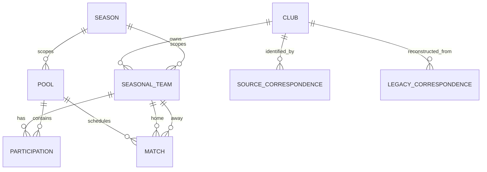

# Blockout V2 domain model

This model derives from the accepted [F01–F14 specifications](../product/specification-perimeters.md)
and constrains their technical projections under the
[constitution](../../.specify/memory/constitution.md). It describes ownership and
invariants, not final table/endpoint definitions. Use the
[V2 architecture](architecture-v2.md) for technology and process decisions and the
[transition design](v1-v2-transition-architecture.md) for historical mappings.

## Owners and identities

| Owner               | Authoritative concepts                                                                                                                                            | Boundary                                                                                     |
| ------------------- | ----------------------------------------------------------------------------------------------------------------------------------------------------------------- | -------------------------------------------------------------------------------------------- |
| Sport               | Club, season, division, competition, pool, seasonal team, participation, match, official ranking, source correspondence, effective fields and sporting visibility | Owns accepted sports facts and source-integration consequences, not fetch success.           |
| Acquisition         | Discovered catalog/reference, family configuration, cycle/execution, normalized observation, completeness and acquisition result                                  | Does not create sporting identity by parsing alone or write Sport tables directly.           |
| Identity/access     | Business account, external principal correspondence, email ownership, permission, installation binding, lifecycle/erasure operation                               | Auth0 authenticates; this owner resolves the business account and current authorization.     |
| Following           | Account-to-team/pool relation and its lifecycle/version                                                                                                           | No club following or automatic seasonal replacement is inferred.                             |
| Contributions       | Link version, submission, quota fact, reporting period and moderation decision                                                                                    | Distinct from assistance tickets; Pro does not grant moderation.                             |
| Pro                 | RevenueCat customer correspondence, verified entitlement fact, effective Pro state, purchase/restore operation                                                    | Paid entitlement recovery is not identity merging.                                           |
| Notifications       | Trigger eligibility, personal entry/read state, consumed announcement fact, destination attempt                                                                   | Push is delivery, not the authority for inbox existence or unread count.                     |
| Assistance          | Submission operation, image manifest, final GitHub correspondence                                                                                                 | Owns complete acceptance and privacy; no in-app ticket conversation/status product is added. |
| Configuration/legal | Maintenance, per-platform minimum app version, current legal publication                                                                                          | Editing and activation permissions remain distinct; minimum version has no operator bypass.  |
| Migration           | Historical registry, correspondence evidence, preserved-object manifest, import result                                                                            | Temporary transition responsibility. Sport owns imported clubs/logos at runtime.             |

Internal IDs identify V2 entities; provider references identify evidence in their
own namespaces. Historical V1 IDs remain explicit mappings. Do not expose database
position, mutable name, match date or a guessed provider equivalence as identity.
Exact SQL representations and API names are derived in feature plans without
changing these meanings.

## Sporting relationships

- A club persists across seasons. A team is seasonal and classified by club,
  division, format and gender with the accepted naming distinctions; it can
  participate in multiple compatible pools.
- A pool belongs to a season and competition context. Pack classification and a
  complete pool override are different inputs. Missing classification blocks new
  eligible acquisition without erasing the last accepted published classification.
- A classification correction preserves identities only when the resulting
  relations are coherent. Split/merge/collision or an affected participation
  outside the accepted scope rejects the whole correction.
- A match requires two identified teams. Qualifier placeholders are not fictitious
  teams. Source/context correspondence preserves identity through rescheduling;
  date/opponents alone are not a match key.
- Verified contextual aliases support identification. Similar names do not justify
  merging clubs, teams or matches. Do not discard meaningful accents/numbers or
  broaden accepted normalization to fuzzy identity resolution.
- Rankings are coherent source snapshots with source positions and special values.
  An unmatched ranking row stays unlinked and does not invent a participant.

## Source evidence and effective values

Keep source reference, observed time, acquired time, integrated time and projected
time distinct. For every consumed field distinguish known, unknown, invalid and
explicitly cleared values. Partial success cannot establish authoritative absence.

F02 source precedence applies by field and context. LNV HTML, XML and FFVB do not
become interchangeable authorities during an outage. A lower-priority source may
fill allowed unknowns, not overwrite a known stronger fact. Scores and sets must
come from compatible observations; official finality is not inferred from elapsed
time or a universal number of sets.

Maintain ordering/version evidence per source/context. A delayed integration cannot
undo a newer observation, operator correction or current restriction. Valid matches
can integrate separately, but absent-match reconciliation waits for the required
complete successful authority integration. Catalog disappearance and calendar
absence have separate accepted meanings. Closed-season history is retained;
exceptional empty historical collection cannot wipe it.

Represent source-managed, manual-value and intentionally-absent modes independently
for address, city, postal code, email, phone and website. Returning to source uses
the current authorized source value, not an arbitrary previous value. Privacy
restrictions dominate all modes. Do not introduce a contact-history archive.

Club logos imported from V1 are manual presentation. An explicit team logo wins;
otherwise teams in every season inherit the current club logo. Missing source
logos do not erase manual presentation. Replacement failure retains the previous
valid presentation.

Geocoding is bound to effective commune/postal context and its version. Changing
that context invalidates the old point; street-only change does not. Only a valid,
unambiguous municipal result for the current context is publishable. Empty,
ambiguous and technical failure remain distinct. An old reply cannot restore an
invalidated point. Acquisition owns attempts; Sport owns durable coordinates.

## Visibility, time and consultation

Visibility is the conjunction of independent current reasons, not one mutable
boolean that every workflow toggles. Reactivating a division removes only its own
restriction. Hidden followed targets retain their relationship but expose no
hidden label/control; reappearance follows F06. Retired matches remain internally
identifiable but are removed from affected public surfaces.

Search, cache, calendars, maps, inbox and deep links apply current restrictions.
An accepted old index document, notification or URL is not permission to disclose
current data. Pro never gates public sporting details, maps or complete calendars.

Date-only and instant-valued schedules are distinct. Source timezone is
Europe/Paris, including DST; display instants use the device timezone. Date-only
values are not shifted into another date. FFVB 00:00 is not automatically a known
kickoff. No reliable date means no public placement requiring one.

An official final result makes a match completed. Without final result, known
kickoff uses H+6 for the consultation category; date-only uses the next midnight
in Europe/Paris. These presentation boundaries do not invent a final result or
trigger a result notification. Calendar pages consist of complete days, with
stable context and no durable duplicates/omissions. Match focus, resume and manual
refresh re-evaluate data and time boundaries; no continuous score stream is added.

## Accounts, rights and lifecycle

Resolve an authenticated issuer/subject through existing verified associations.
Do not create Google/Apple links, merge accounts by email, or normalize email
aliases beyond accepted case-insensitive ownership semantics. Preserve existing
associations even when provider addresses differ. Concurrent first creation has
one business account. Missing/conflicting provider data must not erase recognized
identity or protected ownership.

Authenticated-with-profile-unavailable is distinct from a usable account and from
guest. Public consultation remains usable under F12. Auth0 principal creation
evidence owns the seven-day contribution age; rebuilding business data does not
reset it. Permissions are current action/resource capabilities, not just UI flags
or long-lived token claims.

Every erasure-sensitive operation carries a business-account generation. Durable
erasure acceptance fences all access before external cleanup; later work retries
forward. A new generation cannot be deleted by an old task. Pending supplier
conflicts must be resolved before exposed recreation/restoration. Migration reset
is not voluntary account deletion and must not erase protected principal links,
age or entitlement evidence.

Pro is the union of admissible paid rights and independent valid manual grants.
Keep provider identity, store payer and business beneficiary distinct. Restore
requires an explicit action on the usable account; login alone does not restore
or transfer purchases. A gift does not transfer with a paid receipt. Supplier
behavior must prove the permitted transfer granularity or use verified assistance.

Unknown verification is not confirmed free. Paid/maintained status suppresses ads
and applies the accepted restrained theme, while unknown connected status also
suppresses ads/repurchase prompts. Reliable verification timestamps, known expiry,
revocation, transfer and erasure constrain the five-minute/72-hour rules. Cached
SDK access is not automatically a fresh supplier verification.

## Following, contributions and notifications

Following is unique per account and team/pool identity. Add requires current
visibility; removal/addition versions prevent an old retry reversing a newer
intent. The feed is a deduplicated union of followed targets, not a fallback to
the global calendar. Seasonal selection is shared within the personal feature,
not with search. No automatic season-to-season relationship transfer.

Contributions preserve active and pending versions, ownership, quota consumption
and report-period identity. Normal eligibility uses current nonprofessional match,
account age and timing/finality rules. Quotas and recorded versions commit
together. Rejection/withdrawal does not refund consumed quotas. Identical replay
does not consume twice. Moderation selects one version and obsoletes conflicting
pending versions coherently. Privileged exceptions do not bypass sporting
visibility or professional-match exclusions.

Reports are unique per reporter/version/reporting period. Thresholds are evaluated
under accepted finality rules on new reports; result changes alone do not
retroactively reevaluate thresholds. Reactivation starts a new period. Author
erasure deattributes useful content without resetting quotas or hidden state.

Notification eligibility records confirmed relationships at the trigger, then
checks current eligibility before sending. Result, pre-result-link and
post-result-link allowances are separate per account/match. Initial/history import
does not trigger a result announcement. If result and link are available before
personal result creation, compose the accepted enriched result regardless of
message order; an already-created simple result is not recreated as unread.

One read state is shared across devices. Push attempts belong to installations;
provider acceptance does not prove receipt. After purge retain only necessary
account/match/category consumed facts while both exist, not notification content.
Restoration cannot replenish allowances or republish expired entries.

## Transaction and failure ownership

| Operation                   | Required boundary                                                               | Deferred work / failure policy                                                        |
| --------------------------- | ------------------------------------------------------------------------------- | ------------------------------------------------------------------------------------- |
| Classification correction   | Sport transaction over all affected identities/relations                        | Publish projections through outbox only after acceptance.                             |
| Match integration           | Match-scoped accepted change and ordered source evidence                        | Full-calendar absence reconciliation only after all required successes.               |
| Contribution                | Current match/permission/version, quota facts and resulting state               | Provider link availability is not probed as a condition of the local transaction.     |
| Follow/notification trigger | Coordinated relation version and audience capture                               | Fan-out/current composition can be deferred; no late-follower backfill.               |
| Personal notification       | Serialized account/match and unique consumed category                           | Push is independently attempted/reconciled within its original deadline.              |
| Account erasure             | Durable acceptance and account fence                                            | Auth0/Apple/RevenueCat/files cleanup resumes by generation.                           |
| Support submission          | Stable immutable operation and complete image manifest                          | GitHub uncertainty is reconciled; complete final issue precedes final confirmation.   |
| Logo migration              | Certain correspondence, current import revision and protected manual attachment | Preserve unresolved associations; do not invent identity or overwrite newer V2 edits. |

Internal coordination uses application APIs, shared local transactions and named
lock/version ordering. Database uniqueness is necessary but does not substitute
for current authorization. No remote provider call is part of an open transaction.
Detailed plans must demonstrate these invariants under concurrency, not merely
repeat them as service descriptions.
